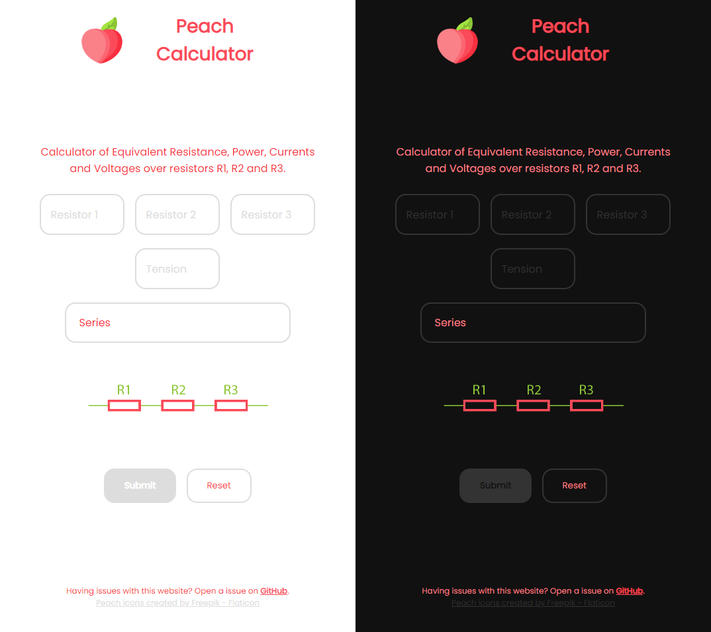
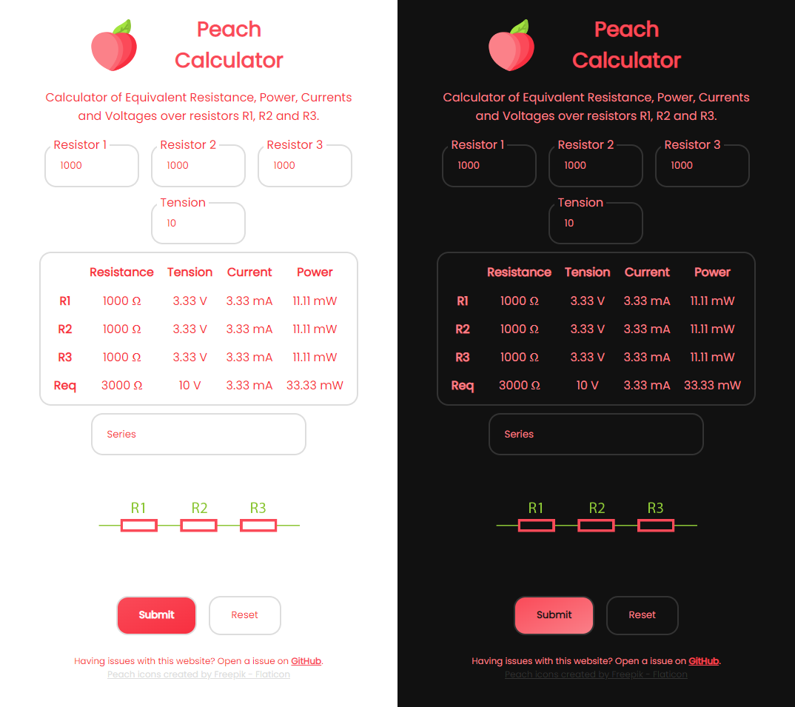

  
  <h1 align="center">Peach Calculator<h3 align="center">Calculator of Equivalent Resistance, Power, Currents and Voltages over resistors R1, R2 and R3. 👨‍💻</h3>

## ScreenShot
  <h5 align="center">Light / Dark</h5>
  
  <h5 align="center">Result</h5>
  

## Input

- Select what is the circuit type:
  - Series
  - Parallel
  - Combinations of Series and Parallel 1
  - Combinations of Series and Parallel 2
- Input tension value
- Input resistor values

## Output

- Table with the values of equivalent resistance, voltages, currents and power in each resistor
